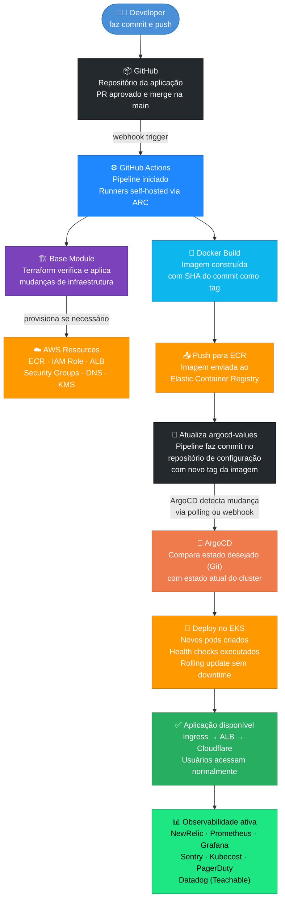
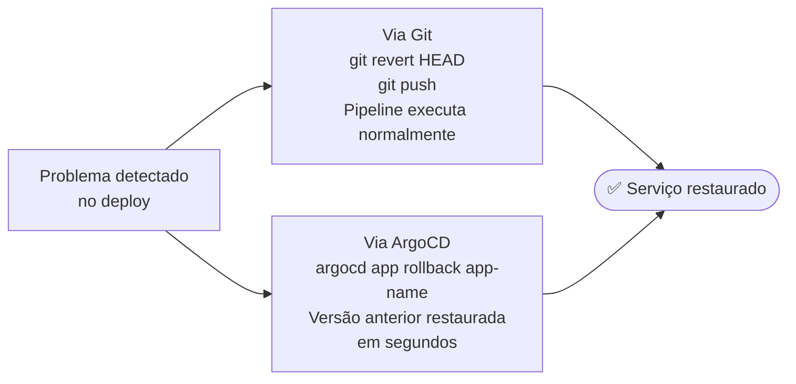

# Diagrama: Fluxo de Deploy

## 📑 Índice

- [Fluxo Completo de Deploy](#fluxo-completo-de-deploy)
- [Descrição de cada etapa](#descrição-de-cada-etapa)
- [Rollback](#rollback)
- [Referências](#referências)

---

> ⚠️ **Nota:** O fluxo via ArgoCD representa o novo modelo de deploy sendo implementado na Hotmart, substituindo o fluxo anterior baseado em Helm upgrade/install/rollback. A migração está em andamento e nem todos os serviços utilizam esse fluxo ainda.

Este diagrama representa o fluxo completo de deploy de uma aplicação na plataforma Hotmart, desde o commit do desenvolvedor até a aplicação disponível para os usuários.

---

## Fluxo Completo de Deploy

---

## Descrição de cada etapa

| Etapa | Descrição |
|---|---|
| Developer faz commit | O fluxo começa com um push para a branch principal após aprovação do PR. Todo deploy começa com uma mudança rastreável no Git |
| GitHub | Repositório central que armazena o código e dispara o pipeline via webhook ao detectar o push |
| GitHub Actions | Pipeline de CI/CD iniciado automaticamente. Roda em runners self-hosted dentro do próprio cluster EKS via Actions Runner Controller |
| Base Module | Se houver mudança na configuração de infraestrutura, o Terraform aplica as alterações necessárias na AWS de forma incremental |
| AWS Resources | Recursos provisionados ou atualizados automaticamente: ECR, IAM Role, ALB, Security Groups, registros DNS e certificados TLS |
| Docker Build | A imagem Docker é construída a partir do código. A tag da imagem usa o SHA do commit para garantir rastreabilidade total |
| Push para ECR | A imagem é enviada para o Elastic Container Registry da conta AWS correspondente, ficando disponível para o deploy |
| Atualiza argocd-values | O pipeline faz um commit no repositório de configuração (devops-helm-iac) atualizando o tag da imagem no arquivo de values |
| ArgoCD detecta mudança | O ArgoCD monitora o repositório de configuração e detecta a mudança automaticamente via polling ou webhook |
| Deploy no EKS | O ArgoCD aplica as mudanças no cluster. O Kubernetes executa um rolling update: novos pods sobem, health checks passam, pods antigos são removidos |
| Aplicação disponível | O tráfego é roteado para os novos pods via Ingress → ALB → Cloudflare. Zero downtime para o usuário final |
| Observabilidade ativa | Métricas, logs e traces são coletados automaticamente. Qualquer anomalia gera alerta no PagerDuty. Datadog é utilizado apenas para Teachable |

---

## Rollback

Se o deploy causar problemas, o rollback pode ser feito de duas formas:

---

## Referências

📄 [`platform-overview/ci-cd-pipelines.md`](../platform-overview/ci-cd-pipelines)
📄 [`platform-overview/argocd-gitops.md`](../platform-overview/argocd-gitops)
📄 [`hands-on/deployment-workflow.md`](../hands-on/deployment-workflow)
