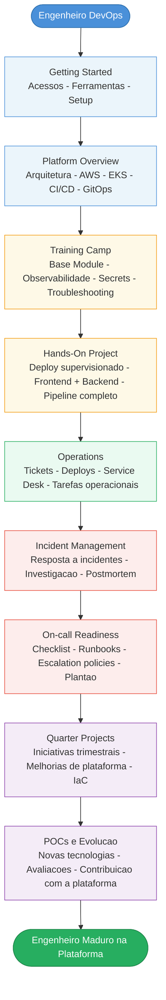

# Diagrama: Jornada DevOps

Este diagrama representa a jornada de evolução de um engenheiro DevOps dentro da Hotmart, desde o primeiro dia até atingir maturidade plena na plataforma.

---

## Fluxo da Jornada

---

## Descrição de cada etapa

| Etapa | Objetivo |
|---|---|
| Getting Started | Configurar acessos, instalar ferramentas e preparar o ambiente local para começar a trabalhar |
| Platform Overview | Entender a arquitetura da plataforma: contas AWS, clusters EKS, CI/CD, GitOps e observabilidade |
| Training Camp | Aprendizado guiado sobre Base Module, monitoramento, secrets e troubleshooting |
| Hands-On Project | Aplicar o conhecimento em um deploy real supervisionado com frontend e backend |
| Operations | Participar do trabalho operacional do dia a dia: tickets, deploys e suporte a times de produto |
| Incident Management | Responder a incidentes reais, investigar causa raiz e participar de postmortems |
| On-call Readiness | Completar o checklist de prontidão e entrar na rotação de plantão |
| Quarter Projects | Contribuir com iniciativas trimestrais de melhoria e evolução da plataforma |
| POCs e Evolução | Avaliar novas tecnologias e contribuir ativamente com a evolução técnica da plataforma |

---

## Referências

📄 [`devops-journey/devops-journey-map.md`](../devops-journey/devops-journey-map)
📄 [`devops-journey/30-60-90-days.md`](../devops-journey/30-60-90-days)
