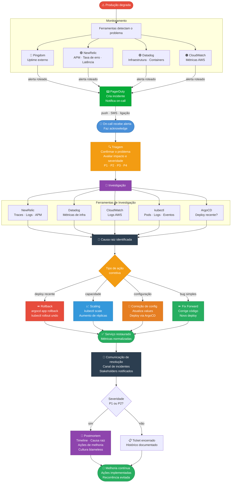
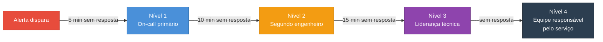

# Diagrama — Fluxo de Resposta a Incidentes

## 📑 Índice

- [Fluxo Principal](#fluxo-principal)
- [Ferramentas por etapa](#ferramentas-por-etapa)
- [Descrição de cada etapa](#descrição-de-cada-etapa)
- [Escalation Policy](#escalation-policy)
- [Referências](#referências)

---

Este diagrama representa o processo completo de resposta a incidentes na Hotmart, desde a detecção automática pelo monitoramento até o encerramento e postmortem.

---

## Fluxo Principal

---

## Ferramentas por etapa

| Etapa | Ferramentas utilizadas |
|---|---|
| Detecção | Pingdom, NewRelic, Datadog, CloudWatch, Statping |
| Notificação | PagerDuty (push, SMS, ligação) |
| Investigação — Aplicação | NewRelic (APM, traces, logs) |
| Investigação — Infraestrutura | Datadog, CloudWatch, kubectl |
| Investigação — Deploy | ArgoCD, GitHub Actions |
| Ação corretiva | ArgoCD, kubectl, GitHub Actions |
| Documentação | Jira, Google Chat |

---

## Descrição de cada etapa

| Etapa | Objetivo |
|---|---|
| Monitoramento detecta | Ferramentas identificam automaticamente condições anormais: queda de uptime, aumento de erro, latência elevada, recursos esgotados |
| PagerDuty cria incidente | Consolida os alertas e notifica o engenheiro de plantão via push, SMS ou ligação conforme a escalation policy |
| On-call faz acknowledge | Sinaliza que alguém está ciente do problema e para a escalação automática |
| Triagem | Confirma se o problema é real, avalia o impacto e define a severidade (P1-P4) |
| Investigação | Coleta evidências usando as ferramentas de observabilidade para identificar a causa raiz |
| Ação corretiva | Executa a solução mais adequada: rollback, scaling, correção de configuração ou fix forward |
| Serviço restaurado | Confirma que as métricas voltaram ao normal e o serviço está operando corretamente |
| Comunicação | Informa stakeholders e o time sobre a resolução com resumo do ocorrido |
| Postmortem | Para P1/P2: análise blameless de causa raiz com ações concretas de melhoria para evitar recorrência |

---

## Escalation Policy

---

## Referências

📄 [`incident-management/incident-process.md`](#/incident-management/incident-process)
📄 [`incident-management/troubleshooting-flow.md`](#/incident-management/troubleshooting-flow)
📄 [`incident-management/postmortem-process.md`](#/incident-management/postmortem-process)
📄 [`oncall-readiness/escalation-policies.md`](#/oncall-readiness/escalation-policies)
