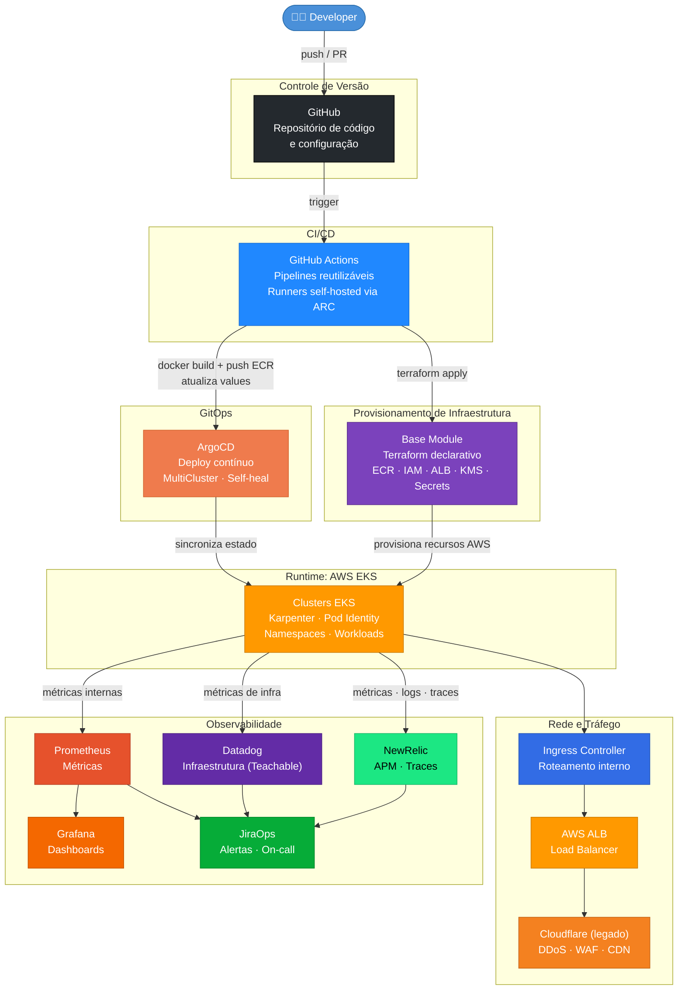

# Diagrama: Arquitetura da Plataforma

Este diagrama representa a arquitetura geral da plataforma DevOps da Hotmart, mostrando como os componentes se conectam desde o código do desenvolvedor até a aplicação em produção com monitoramento ativo.

---

## Arquitetura Geral

---

## Papel de cada componente

| Componente | Papel na plataforma |
|---|---|
| Developer | Escreve código, abre PRs e dispara o fluxo de deploy via commit |
| GitHub | Repositório central de código e configuração. Fonte da verdade para o estado das aplicações |
| GitHub Actions | Executa pipelines de CI/CD: build, testes, push de imagem e atualização de configuração. Runners self-hosted via ARC no próprio cluster |
| Base Module | Módulo Terraform que provisiona automaticamente toda a infraestrutura AWS necessária para uma aplicação a partir de um YAML declarativo |
| ArgoCD | Implementa o modelo GitOps: monitora repositórios de configuração e sincroniza o estado dos clusters com o estado declarado no Git |
| EKS | Clusters Kubernetes gerenciados pela AWS onde os workloads rodam. Karpenter gerencia o provisionamento automático de nodes |
| Cloudflare (legado) | Primeira camada de proteção: DDoS, WAF, CDN e terminação TLS para tráfego externo |
| ALB | Application Load Balancer da AWS que recebe o tráfego do Cloudflare (legado) e distribui para os pods |
| Ingress Controller | Gerencia o roteamento interno do cluster com base nos recursos Ingress do Kubernetes |
| NewRelic | APM e observabilidade de aplicação: traces distribuídos, taxa de erro, latência e performance |
| Datadog | Monitoramento de infraestrutura: nodes, containers, uso de recursos e rede *(exclusivo Teachable; em remoção da plataforma principal)* |
| Prometheus | Coleta métricas internas do cluster e das aplicações para alertas e dashboards |
| Grafana | Visualização de métricas em dashboards operacionais |
| JiraOps | Recebe alertas de todas as ferramentas de monitoramento e gerencia notificações e rotação de on-call |

---

## Referências

📄 [`platform-overview/platform-architecture.md`](../platform-overview/platform-architecture)
📄 [`platform-overview/eks-clusters.md`](../platform-overview/eks-clusters)
📄 [`platform-overview/observability-stack.md`](../platform-overview/observability-stack)
